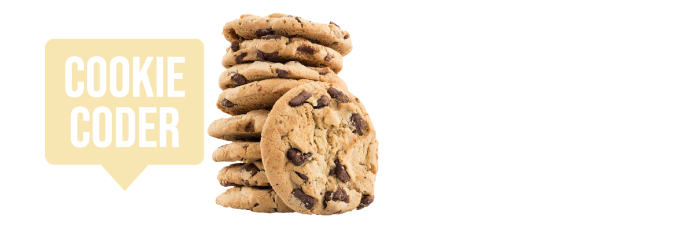

# Project Proposal

## Group
Dayne, Felicia, Myles, Jackie

**Project Title**

`Cookie Coder`

*Problem*

Junior Developers need a tool to store and recycle useful code snippets.

*Solution*

An app that can store and organize code snippets.

**Dependencies**

Three group members using PC one using Mac. Make sure we’re all using same `Node` and `NPM` engines. Dayne will push code with package.json and we can then clone it so we’re all working on same version. At which point we’ll divide tasks. There will be a to do list on Discord.

**Branch Protection**

Dayne setup branch protection and will do approvals moving forward.

**Wireframe**

Core user flow will be steps a user has to take to achieve assigning a code snippet or writing their personal list of code snippets.

**Component Libraries**

`Tailwind`

**Database**

`Mongo`
